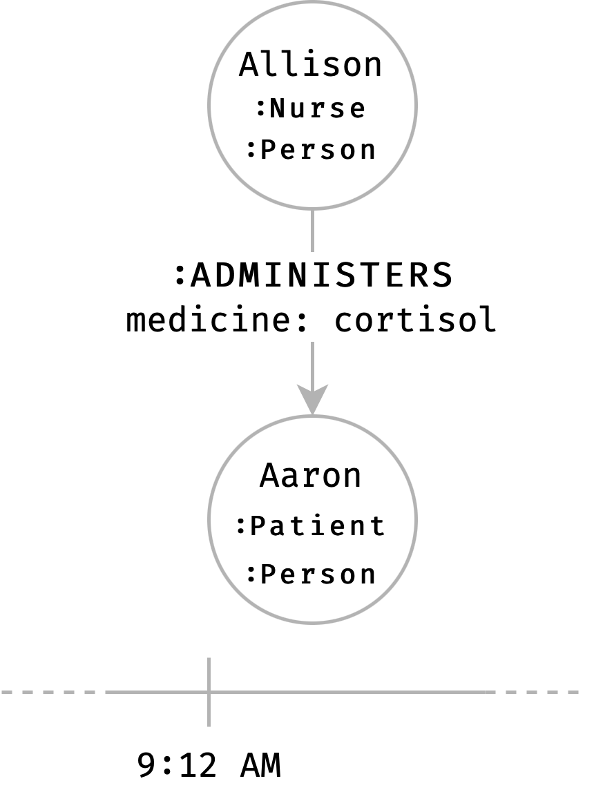
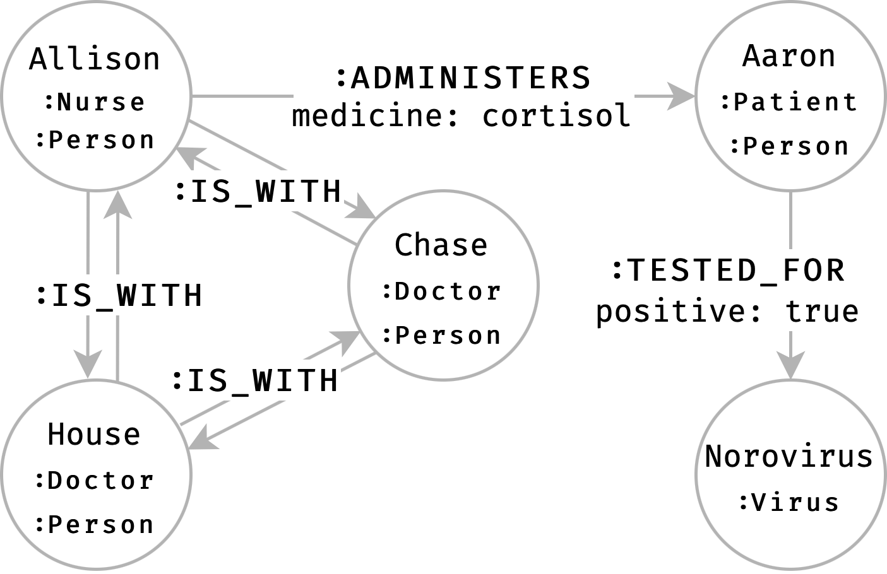

# Princeton–Plainsboro Teaching Hospital (PPTH)

The  Princeton–Plainsboro Teaching Hospital (PPTH) has a strict policy to prevent the diffusion of viruses inside the buildings.
Even if nowadays the Covid Sars 19 is quite popular, there are a number of known visuses that are still widespread.

As normally happens in hospitals, patients are tested for the presence of viruses infections, and nusers administrate medicines to patients.
Such tests are recorded into the Kafka Hospital Deployment (KOD).
An example of such events is depicted in the figures below.




Doctors and nurses are equiped with a Smart Identification Tag (SIT).
Such a tag, besides displaing information abount the hospital operator, integrates a small Beacon that emits Bluetooth Low Energy signals.
Rooms, corridors and stairs are provided with antennas that, exploiting the signals sent by the SITs, allows for identification the positions of people inside the hospital.
Each antenna is responsible for triggering localization event whenever a person is in a room.
Such information is then processed to emit presence events whenever two or more people are in the same room.
An example of such presence events, easily represented with a property graph, is depicted in the figure below.


Each antenna expoits a private hospital Wi-Fi network to push such event into the Kafka Hospital Deployment (KOD).

In order to reduce the spread of viruses throunght hospotal operators, Lisa, the hospital's head administrator wants to exploit the data available to detect possible infection across the hospital.
Indeed, there are viruses that can be easily trasmitted from patient to doctors and nurses.

## Lisa's goal
The main goal is to indentify hospital operators that, in the last 24 hours, have been in the same room with a patient that tested positive for a specific virus.
Such operators are going to be tested for the virus.
Moreover, due to the high transmissibility of the viruses, also the collegues that have been in contact with the potentially infected hospital operator have to be tested for the viruses.
Lisa requires such information to be computed in real time, as soon as the data for the computation is available.

## Solution design

The hospital administration delegates the realization of a solution able to archive such a goal to the Hospital Development Team.

Eric, the Lead Data Scientist, loaded the events from the last 24 hours into a Neo4j instance, obtaing the propery graph depicted in the figure below.



```
CREATE 
    (allison:Nurse:Person {name:"Allison"}),
    (house:Doctor:Person {name:"Gregory"}),
    (chase:Doctor:Person {name:"Chase"}),
    (aaron:Patient:Person {name:"Aaron"}),
    (norovirus:Virus {name:"Norovirus"}),
    (allison)-[:ADMINISTERS {medicine:"cortisol"}]->(aaron),
    (allison)-[:IS_WITH]->(house),
    (house)-[:IS_WITH]->(chase),
    (chase)-[:IS_WITH]->(allison),
    (aaron)-[:TESTED_FOR {positive: true}]->(norovirus)
```

Eric, with the help of Dr. House that acts as domain experts, designed a Cypher query that retrieves the people to be tested for diseases.
Such a query is reported below.

```
MATCH
    (patient:Patient)-[:TESTED_FOR {positive:true}]->(virus:Virus),
    (person:Person)-[:ADMINISTERS|IS_WITH*1..3]-(patient)
RETURN DISTINCT person.name, virus.name
```

However, the hospital admin want to retrieve such information in real time, as soon as the data for computing the is available.
Eric does not have the capabilities of designing such a system.
However, he can outsource the realizazion of such a system, as far as he is able to identify some requirements.
In particular, eric wants a more expressing language that fulfill the following requirements:

- Ease of specification. Declarative and intuitive formulation of the query.
- Reusability: Cypher queries must be compatible with seraph. 
- Generalization and specialization. The language should allow a sufficient level of generality so that it can be automatically applied for different data schemas, while allowing specialization on any given domain.

Moreover, the system should provide:
- Precise control on data ingestion from the event stream. (windows)
- Precise control on evaluation time instant.
- Precise control on output processing and emitting phase.

## Seraph
The analysis of such requirements guided the design of Seraph.

In the remaining of this section we illunstrate how the seraph system can be used to sullfill the requirement of the hospital administration.

CONTINUE WITH THE REAL EXAMPLE

## Producing graphs
The presence events depicted in the figure above are computed from a query that continuosly computes people in the same location.

```
CREATE 
    (allison:Nurse:Person {name:"Allison"}),
    (house:Doctor:Person {name:"Gregory"}),
    (chase:Doctor:Person {name:"Chase"}),
    (bar:Room {name:"Bar"}),
    (allison)-[:IN]->(bar),
    (chase)-[:IN]->(bar),
    (house)-[:IN]->(bar),
    (aldo:Actor:Person {name:"Aldo"}),
    (giovanni:Actor:Person {name:"Giovanni"}),
    (giacomo:Actor:Person {name:"Giacomo"}),
    (gastani:Actor:Person {name:"Gastani"}),
    (loundry:Room {name:"Loundry"}),
    (aldo)-[:IN]->(loundry),
    (giovanni)-[:IN]->(loundry),
    (giacomo)-[:IN]->(loundry),
    (gastani)-[:IN]->(loundry)
```

```
MATCH
    (p1:Person)-[:IN]->(room:Room),
    (p2:Person)-[:IN]->(room)
CREATE 
    (p1)-[:IS_WITH]->(p2)
```

## Aknowledgements
I really enjoyed the Dr. House TV series.
This use case is somehow inspired from such a TV series, and the names of the
characters in the use case are not random, they are taken from the original
TV series and in particular from the episode A Pox on Our House (Episode 7 
Season 7).


## Utils
```
MATCH (n) DETACH DELETE n
```
